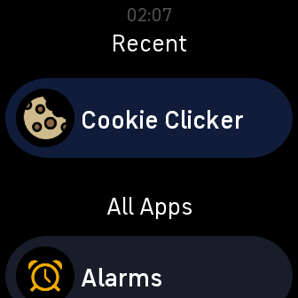
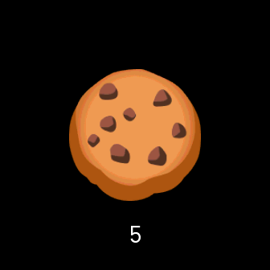
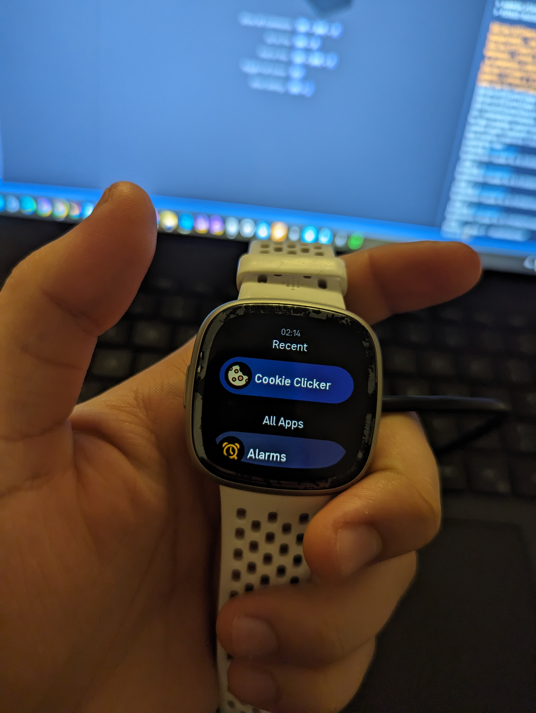
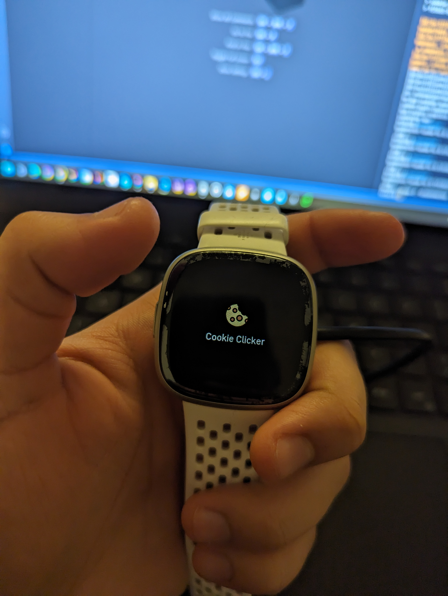
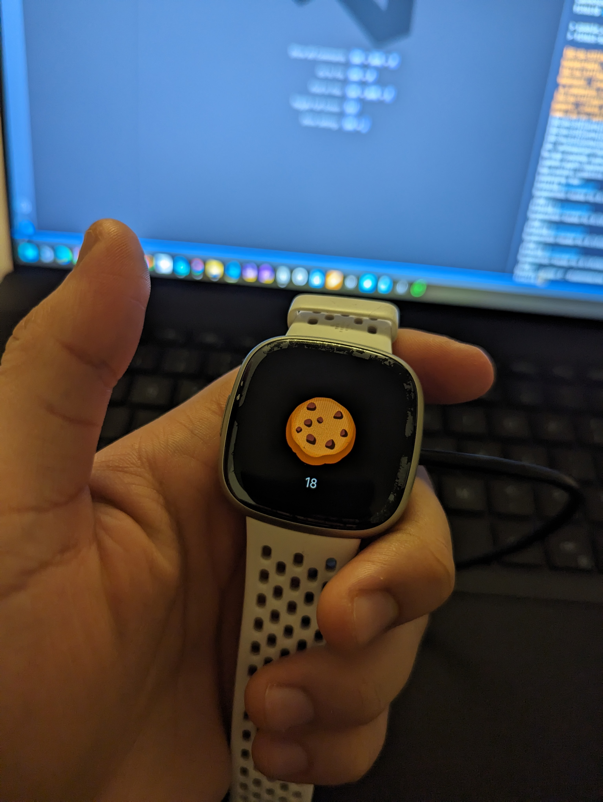

# Fibit Sense 2 - App - Cookie Clicker

A one-day project exploring a curiousity I had of how to develop a smartwatch app.

Unfortunately, this app was made using an unofficial approach for building and sideloading 3rd-party applications as Fitbit does not provide an SDK for Sense 2, which is what I had at the time of development (see https://github.com/cmengler/fitbit-app-versa4).

Therefore, you won't find it on the official Fitbit app store for a Sense 2.

## Screenshots

| App List | App |
| - | - |
 | 

## Shots
| App List | Loading | App |
| - | - | - |
 |  | 